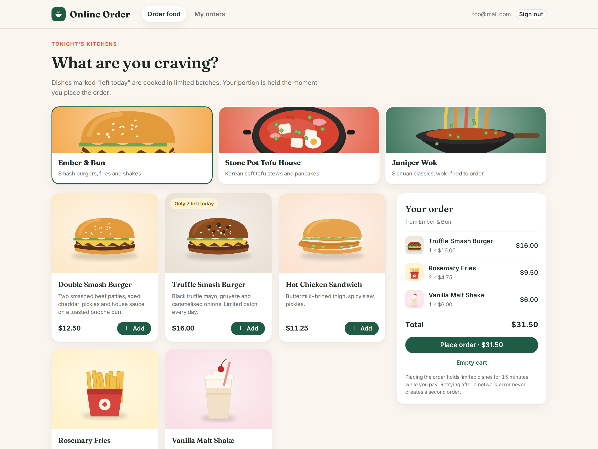
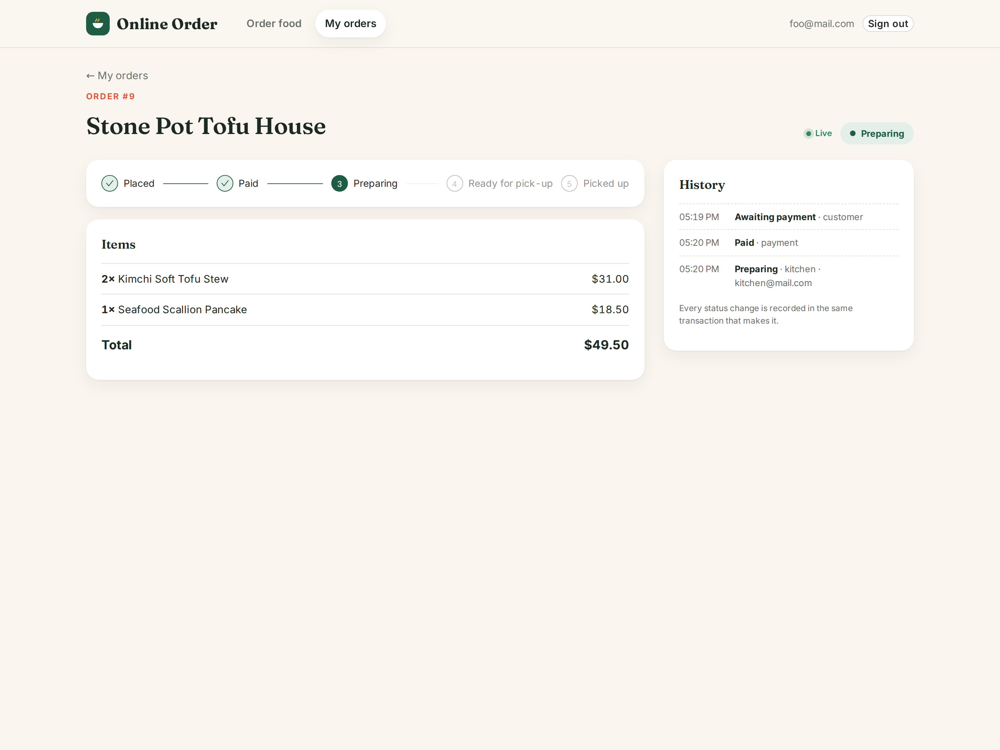
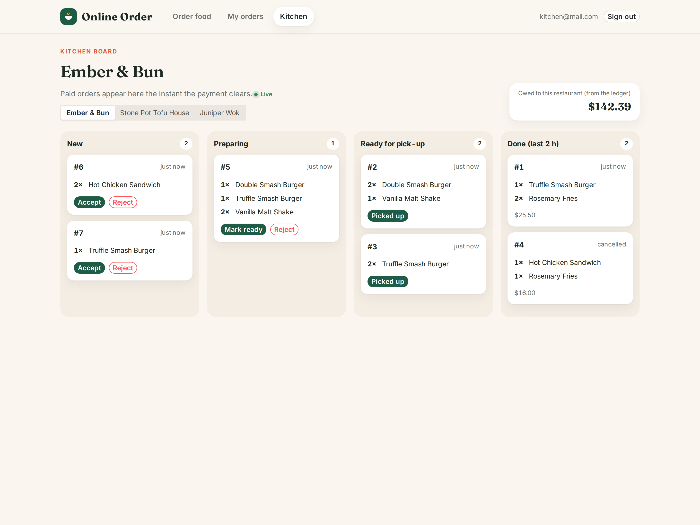
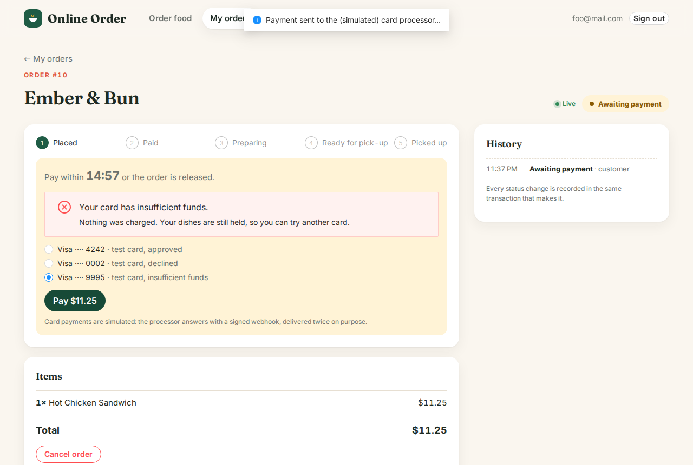
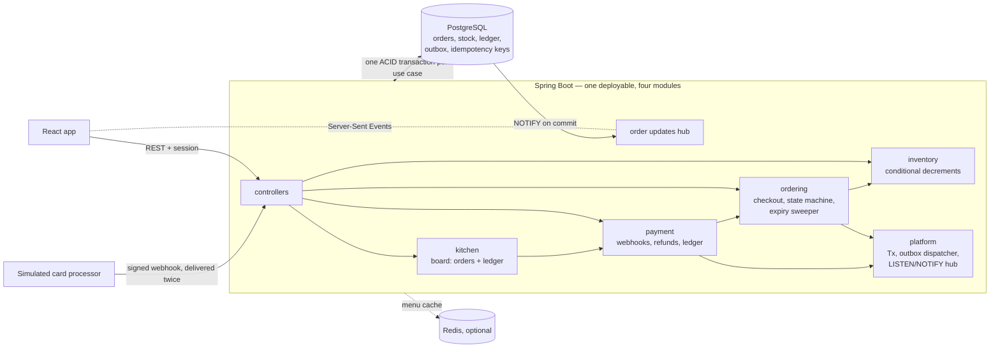

# Online Order

A food-ordering platform built as a **modular monolith on PostgreSQL**: Spring Boot 3 (Java 21), React 18 + TypeScript. The emphasis is on the parts of an ordering system that must stay correct when many people act at once. Limited dishes are never oversold, a retried checkout never creates a second order, a duplicated payment webhook never charges twice, and every cent moves through a double-entry ledger.



| Order tracking, updated live | Kitchen board, updated live | A declined card, explained |
|---|---|---|
|  |  |  |

Screenshots of the real application running locally against PostgreSQL. The sample data (3 fictional restaurants, orders placed by a seeding script) and the food illustrations, which are generated from code in `doordash-app/scripts/food-art.py`, are not real customers or brands. Payments go through a built-in **simulated** card processor.

## What it does

- **Customers** browse three kitchens, add dishes to a cart and place an order. Some dishes are cooked in limited daily batches ("Only 7 left today"). The order holds its portion for 15 minutes while the customer pays, then status updates arrive live: paid → preparing → ready → picked up.
- **Kitchen staff** see paid orders appear on a board the moment the payment clears. They accept, reject (which refunds the customer automatically), mark ready and hand over. The board also shows what the platform owes the restaurant, read from the ledger.
- **The system** cancels unpaid orders when their window closes and returns their stock. It refunds a payment that lands after the order expired, and it delivers notifications and refunds through a transactional outbox.

## Architecture in one picture



The same problems as [SocialAI](https://github.com/Rolinmuuu/Social-AI-Backend) are solved here with the opposite choices, on purpose:

| | SocialAI | Online Order |
|---|---|---|
| Shape | Go microservices | One Spring Boot service, split into modules with one-way dependencies |
| Consistency | eventual, event-driven | strong: each use case is one PostgreSQL transaction |
| Messaging | Kafka | PostgreSQL: outbox table + `FOR UPDATE SKIP LOCKED` workers, `LISTEN/NOTIFY` for live updates |
| Idempotency | Redis `SET NX` | a unique key claimed inside the business transaction |
| Hard part | read fan-out, hot documents | write contention: stock, payments, state races |

Why this project does not use microservices, and the other decisions, are in **[docs/ARCHITECTURE.md](docs/ARCHITECTURE.md)**, written as decision records. Measured throughput and the bottleneck analysis are in **[docs/SCALING.md](docs/SCALING.md)**. SLOs, alerts and the runbook for each are in **[docs/OPERATIONS.md](docs/OPERATIONS.md)**. The AWS target design is in **[docs/CLOUD.md](docs/CLOUD.md)** (a design only, not deployed).

## Guarantees and the test behind each

All of these are integration tests against a real PostgreSQL (`OnlineOrder/src/test/java/.../it`), because they depend on the database's own behaviour: locks, constraints, deferred triggers and NOTIFY.

| Guarantee | How | Test |
|---|---|---|
| Limited stock is never oversold | `UPDATE … SET available = available - q WHERE available >= q` (re-checked after a lock wait) + `CHECK (available >= 0)` | 40 customers race for 10 units → exactly 10 orders (`InventoryConcurrencyIT`) |
| No deadlocks between orders | rows locked in ascending id order | opposite order deadlocks, sorted order does not (same test class) |
| Add-to-cart and checkout never deadlock | both take the item rows before the cart row | `CheckoutIT` replays add-to-cart against checkout; the old lock order fails it |
| A retried checkout makes one order | `Idempotency-Key` inserted in the checkout transaction; a concurrent duplicate waits on the unique index, then replays | 20 concurrent retries → 1 order (`CheckoutIT`) |
| No charge for an amount the customer did not see | client sends the displayed total; mismatch → 409 `PRICE_CHANGED` with the new total for the customer to confirm | `CheckoutIT` |
| Live updates only for committed changes | `pg_notify` inside the transaction | rolled-back checkout announces nothing (`CheckoutIT`) |
| Races between the kitchen and the customer have one winner | guarded update `… WHERE id = ? AND status = ?` | accept vs cancel, 15 rounds (`OrderLifecycleIT`) |
| Duplicate or forged webhooks do nothing | provider event id is the primary key of `payment_events`; HMAC-SHA256 signature with a 5-minute timestamp window | 5 simultaneous deliveries → 1 capture; forged, stale and tampered bodies → 401 |
| Money that should not have been taken goes back | late payment after expiry, wrong captured amount, rejected order → refund via the outbox | `OrderLifecycleIT` |
| Money always balances | double-entry ledger; a deferred constraint trigger rejects an unbalanced transaction at COMMIT; entries are append-only | `LedgerAndOutboxIT` |
| Unpaid orders release stock exactly once | sweeper claims rows with `FOR UPDATE SKIP LOCKED` | two sweepers in parallel → each order cancelled once |
| Side effects happen iff the transaction commits | transactional outbox; claim with a lease, deliver outside the claim; external calls outside any transaction | 3 parallel dispatchers, 300 messages → 300 deliveries; a failing handler is retried later |
| A declined card leaves the order payable, and the customer sees why at once | `payment.failed` stores the reason and NOTIFYs although the status is unchanged; a retry is a new charge | `OrderLifecycleIT`, and end to end in Playwright |
| Metrics agree with the database | counters inside a transaction increment after COMMIT, never on rollback | `MetricsIT` |
| The module map holds | ArchUnit rules: no cycles, `ordering` never imports `payment`, `platform` imports no module | `ModuleBoundaryTests` |
| A restart keeps the data; migrations are re-runnable | Flyway, sample menu as an idempotent repeatable migration, reset refused outside demo mode | `MigrationsIT` |

## Run it

The whole system, with the monitoring it would have in production:

```bash
docker compose up --build            # app http://localhost:8080 · Grafana http://localhost:3001 · Prometheus :9090
```

Or for backend development, with the app on the host:

```bash
cd OnlineOrder
docker compose up -d                 # PostgreSQL + Redis
./gradlew bootRun -PwithFrontend     # http://localhost:8080 (builds and serves the frontend too)
```

Sign in as `foo@mail.com` (customer) or `kitchen@mail.com` (kitchen staff of all three restaurants), password `123456`. Use two browser windows to watch the kitchen and the customer update each other live. At checkout, pick a test card: `···4242` is approved, `···0002` and `···9995` are declined. `CACHE_TYPE=simple` runs without Redis: PostgreSQL is the only required dependency. `DB_RESET_ON_START=true` starts from a fresh database (demo mode only).

Frontend development server: `cd doordash-app && npm ci && npm run dev` (Vite on port 3000, proxies the API to 8080).

## Test

```bash
cd OnlineOrder && ./gradlew test         # unit, integration (real PostgreSQL), web and architecture tests
cd doordash-app && npm run lint && npm run typecheck && npm test
cd doordash-app && npm run e2e           # Playwright, against a running app (see playwright.config.ts)
```

The integration tests connect with `TEST_DATABASE_URL` (default `jdbc:postgresql://localhost:5432/onlineorder_test`, a database of its own: create it once with `createdb -h localhost -U postgres onlineorder_test`), `TEST_DATABASE_USER` and `TEST_DATABASE_PASSWORD`, and rebuild the schema with Flyway before each test. CI (`.github/workflows/ci.yml`) runs every suite on every push, builds the production image, runs the end-to-end tests against the real jar, and validates the alert rules; CodeQL and Dependabot run alongside.

## API

The full contract is **[docs/openapi.json](docs/openapi.json)** (OpenAPI 3), also served with Swagger UI at `http://localhost:8081/actuator/swagger-ui` (the internal management port). `OpenApiContractTests` fails the build when the running API and the committed file disagree, so every API change shows up as a diff in review.

| Method | Path | Who | Notes |
|---|---|---|---|
| `POST` | `/signup`, `/login`, `/logout` | public | form login, session cookie; signup 400 `VALIDATION_FAILED` / 409 `EMAIL_TAKEN`; 429 `RATE_LIMITED` with `Retry-After` |
| `GET` | `/me` | signed in | current user, whether they are kitchen staff |
| `GET` | `/restaurants/menu`, `/inventory` | public | menus (cached), units left of limited dishes |
| `GET` `POST` | `/cart`, `/cart/clear` | customer | add to cart retries on optimistic-lock conflicts (`/cart/checkout` is an old alias of `/cart/clear`) |
| `POST` | `/orders` | customer | checkout; header `Idempotency-Key`, body `{"expected_total_cents": …}`; 409 `OUT_OF_STOCK` / `PRICE_CHANGED` / `MIXED_RESTAURANTS` |
| `GET` | `/orders`, `/orders/{id}` | customer | with lines and the audit trail |
| `POST` | `/orders/{id}/pay`, `/orders/{id}/cancel` | customer | pay: body `{"payment_method": "tok_visa"}` (a processor token; the simulator's decline tokens decline); cancel until the kitchen accepts, refunded if paid |
| `GET` | `/orders/stream` | customer | Server-Sent Events for the customer's orders |
| `GET` | `/kitchen/restaurants/{id}/orders`, `…/stream` | staff | board + amount owed from the ledger; live stream |
| `POST` | `/kitchen/orders/{id}/{accept\|ready\|complete\|reject}` | staff | 409 if the order moved meanwhile |
| `POST` | `/payments/webhook` | processor | authenticated by `X-Payment-Signature` (HMAC), not a session |

## Configuration

| Variable | Default | |
|---|---|---|
| `DATABASE_URL`, `DATABASE_PORT`, `DATABASE_USERNAME`, `DATABASE_PASSWORD` | `localhost`, `5432`, `postgres`, `secret` | PostgreSQL |
| `APP_DEMO` | `true` (`false` in the Docker image) | demo accounts and the simulated card processor; set `false` anywhere real |
| `PAYMENT_WEBHOOK_SECRET` | development value | shared secret for webhook signatures; required when `APP_DEMO=false` |
| `DB_RESET_ON_START` | `false` | drop everything and migrate from scratch; refused unless demo mode |
| `CACHE_TYPE` | `redis` | `simple` for an in-memory menu cache (no Redis) |
| `REDIS_HOST`, `REDIS_PORT` | `localhost`, `6379` | |
| `ORDER_PAY_WITHIN_SECONDS` | `900` | unpaid orders are cancelled after this |
| `BACKGROUND_JOBS` | `true` | outbox dispatcher, expiry sweeper, gauges, live-update listener |
| `MANAGEMENT_PORT` | `8081` | health and Prometheus metrics, kept off the public port |

Observability, rate-limit and shutdown settings are in [docs/OPERATIONS.md](docs/OPERATIONS.md#configuration-reference).

## Production readiness

| | |
|---|---|
| Schema | Flyway migrations, expand-safe so a rolling deploy and a rollback both work (ADR 9) |
| Health | liveness and readiness probes on an internal port; Redis deliberately excluded |
| Metrics | business counters that only count committed work, gauges for silent failures (stuck outbox, unswept orders, unbalanced ledger), per-route latency histograms |
| Alerts | 9 Prometheus rules including a multi-window error-budget burn, each with a runbook |
| Logs and traces | JSON logs with trace ids; `X-Trace-Id` on every response; OTLP export |
| Abuse | token-bucket limits on login (per address and per account), signup and checkout |
| Sessions | stored in PostgreSQL: a deploy signs nobody out, any instance serves any user |
| Image | multi-stage, layered, non-root, secure defaults, graceful shutdown |
| Supply chain | Dependabot, CodeQL, the built frontend is never committed |

## History

This started as a course-style DoorDash clone (menus, cart, Redis-cached menus, `@Version` on the cart), deployed once on AWS App Runner + RDS; that deployment has been shut down. The ordering, inventory, payment and platform modules, the integration tests and the new interface came later, followed by the production work: migrations, observability, rate limiting, the TypeScript frontend, end-to-end tests and the delivery pipeline.

## License

MIT
