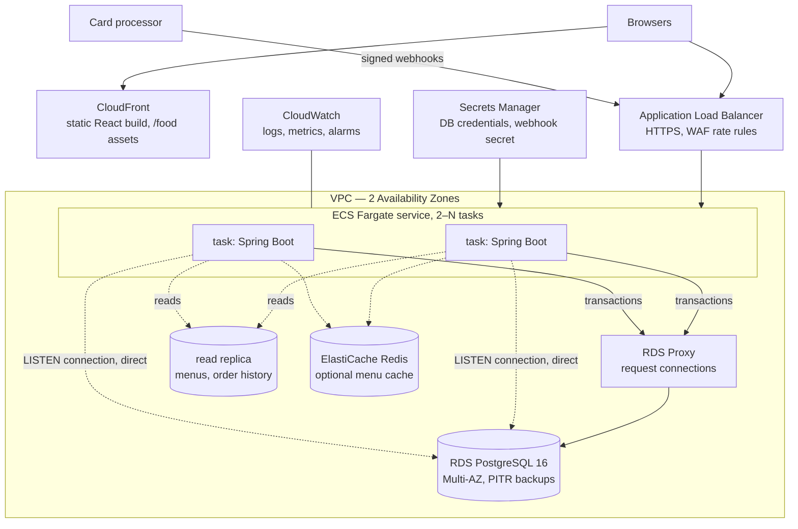

# Cloud architecture on AWS (target design)

> Status: **design, not deployed.** An earlier version of this app did run on AWS App Runner +
> RDS PostgreSQL + ECR; that deployment has been shut down to avoid cost. This page describes how
> the current version should be run, and why.

## Choices

| Choice | Why |
|---|---|
| **ECS Fargate behind an ALB** (App Runner is fine at small scale) | SSE streams are long-lived HTTP responses. The 20 s heartbeat keeps them inside the ALB's default idle timeout; deployments drain connections, and clients reconnect and re-fetch. |
| **No sticky sessions needed for live updates** | every task LISTENs to PostgreSQL, so whichever task holds a browser's stream receives every committed change |
| **Spring Session in the database** (done, ADR 14) | form-login sessions survive a request landing on another task and a deploy |
| **RDS Multi-AZ** | a synchronous standby. The system of record for money should not lose a committed transaction on an AZ failure; failover is about 60–120 s. |
| **RDS Proxy for request traffic, direct connection for LISTEN** | the proxy multiplexes pooled connections across tasks, but LISTEN needs a session that stays pinned. `OrderUpdatesHub` already opens its own connection outside the pool; in AWS it would point at the database endpoint instead of the proxy (a second URL, not yet a separate setting). |
| **Read replica for menus and history** | the first load to move off the primary. Checkout, payment and the kitchen always use the primary (read-your-writes). |
| **Secrets Manager** | DB password and webhook secret are injected as task environment; nothing in the image or the repository |
| **CloudFront for the frontend** | static build and illustrations at the edge; the API stays behind the ALB |

## Failure modes

| Failure | What happens |
|---|---|
| A task dies mid-checkout | its transaction rolls back: no order, stock untouched, the idempotency key released. The client retries with the same key. |
| A task dies mid-dispatch | the claimed outbox rows unlock when its connection drops; another task takes them. External calls carry idempotency keys. |
| Primary fails over | in-flight transactions fail, and clients retry (checkout safely, thanks to the idempotency key). LISTEN connections reconnect with backoff; browsers re-fetch on reconnect. |
| Card processor is down | orders stay PLACED. Unpaid ones expire and release stock; refunds wait in the outbox and retry with backoff. |
| Webhook secret leaked | rotate it in Secrets Manager and at the provider. Verification can accept two secrets during the rotation window (small extension of `WebhookSignature`). |

## Operations

- **Alarms:** the rules in `deploy/prometheus/alerts.yml` (Amazon Managed Prometheus can load
  them as-is), with runbooks in OPERATIONS.md: p95 latency per route; 5xx rate; `outbox` rows with `attempts > 5` or
  `available_at` far in the past; unpaid orders past `pay_by` that were not swept; any ledger
  transaction whose legs do not sum to zero (should be impossible; checked nightly as a query);
  RDS CPU, connections and replica lag.
- **Delivery:** GitHub Actions builds and tests against PostgreSQL, pushes the image to ECR,
  then does a rolling ECS deploy with the deployment circuit breaker (automatic rollback).
  Authentication is GitHub OIDC → IAM role, with no long-lived keys.
- **Settings for a real environment:** `APP_DEMO=false` (no demo accounts, no simulated
  processor; the image defaults to it), `PAYMENT_WEBHOOK_SECRET` from Secrets Manager,
  `FLYWAY_LOCATIONS=classpath:db/migration` (no sample menu), `server.forward-headers-strategy=native`
  behind the ALB, `MANAGEMENT_OTLP_TRACING_ENDPOINT` for traces.
- **Health checks:** the ALB target group checks `GET :8081/actuator/health/readiness`; the ALB
  listener forwards only port 8080, so metrics are reachable from inside the VPC only.
- **Schema changes:** Flyway migrations run at task start (ARCHITECTURE.md, ADR 9). Every
  migration must be expand-safe, because a rolling deploy runs the old and new task versions
  against the same schema.
- **Cost:** at demo scale the bill is dominated by Multi-AZ RDS; a single-AZ database roughly
  halves it. Estimate with the AWS Pricing Calculator before deploying.
